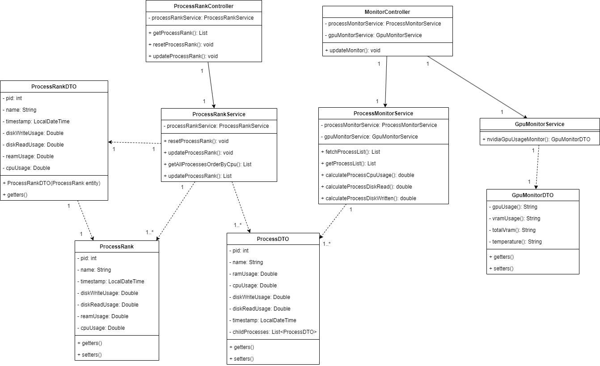

# Resource Tracker
## :books: Bem vindo ao projeto Resource Tracker
O **Resource Tracker** é um projeto desenvolvido para monitorar processos do computador, oferecendo um sistema de ranking que exibe os processos que mais consumiram recursos enquanto o sistema esteve em execução.

A principal motivação para este projeto foi aprimorar meus conhecimentos sobre WebSocket, Stomp, React, Spring, Java e Electron. 

Esse repositório contém o **back-end** do projeto. Acesse o link [https://github.com/fael890/resource-tracker-frontend](https://github.com/fael890/resource-tracker-frontend), caso queira entrar no repositório do front-end.

Se você optar por baixa a release, o **front-end já está incluso**, pois essa separação foi feita apenas para organização do projeto.

### 🔩 Pré requisitos
- Java JDK versão 21 ou superior
- Maven versão 3.9.9 ou superior
- Node versão 22.x (recomendado: 22.12.0 ou superior dentro da mesma versão principal)

### :computer: Executando o projeto
Meu objetivo foi tornar a utilização deste projeto o mais simples possível. Como fiz isso?

Criei scripts em PowerShell e Batch para que o front-end e o back-end sejam iniciados com a execução de um único arquivo. Para mais detalhes, confira a seção [Facilitando a Execução com Scripts.](#-facilitando-a-execução-com-scripts) 

Para facilitar ainda mais, disponibilizei uma release chamada `resource-tracker-v1.0.0-windows`, que você pode baixar diretamente neste link: [Acesse a release aqui!](https://github.com/fael890/resource-tracker/releases/tag/v1.0.0).

**Como executar?**
Se você tiver os [pré-requisitos](#-pré-requisitos) instalados, siga os passos abaixo:

1. Acesse o link da release e baixe o arquivo `resource-tracker-1.0.0v-windows.zip`.
2. Extraia o conteúdo do ZIP.
3. Execute o arquivo `resource-tracker-start.bat`

## :book: Tecnologias utilizadas

            

## :pencil2: Desenvolvimento
### :file_folder: Estrutura do Projeto
- Controller: contém os controladores responsáveis por gerenciar as requisições feitas para a API.
- Entity: armazena as classes do modelo de negócio, que são mapeadas como tabelas no banco de dados.
- Service: contém as classes de serviço responsáveis por implementar as regras de negócio do sistema.
- Repository: camada responsável pelo acesso aos dados. Contém os repositórios do JPA, permitindo consultas personalizadas.
- DTO: armazena os Data Transfer Objects (DTOs), utilizados para selecionar dados específicos das entidades, aumentando a segurança e evitando a exposição direta dos modelos na API.
- Websocket: contém todos os arquivos de configuração necessários do websocket

### :mag_right: Class diagram



### :page_facing_up: API Endpoints

| Método   | Endpoint                         | Descrição                                            | Exemplo de Corpo (se aplicável)             |
|----------|----------------------------------|------------------------------------------------------|---------------------------------------------|
| GET      | `/rank/cpu-usage`                | Retorna os rank de process ordenado por uso de CPU.  | -                                           |
| DELETE   | `/rank/reset`                    | Deleta todos processos do ranking.                   | -                                           |
|WS CONNECT| `ws://localhost:8080/connection` | Conecta o cliente no websocket.                      | -                                           |
| GET      | `/topic/monitor`                 | Inscreve o cliente para receber mensagens.           | -                                           |

### 🔩 Facilitando a Execução com Scripts

Para facilitar a execução do front-end e do back-end, optei por utilizar alguns scripts que inicializam o Electron em um terminal e o Spring em outro. Abaixo, segue o código do script ".ps1":

````
Start-Process cmd -ArgumentList "/k java -jar resourcetracker-0.0.1-SNAPSHOT.jar" 
cd .\resource-tracker-GUI

$NpmNextDependencies = '.\.next'
$NpmNodeModule = '.\node_modules'

if ((Test-Path -Path $NpmNextDependencies) -and (Test-Path -Path $NpmNodeModule)) {
    npm run electron
} else {
    npm install
    npm run electron
}

cd ..
````
Dessa forma, não é necessário incluir os diretórios `node_modules` e `.next` no download, pois o script verifica se essas pastas já existem antes de executar a instalação.
Além desse script, criei outro script do tipo ".bat":

````
@echo off
Powershell.exe -ExecutionPolicy Bypass -File resource-tracker-config.ps1
````
Este trecho tem a função de executar o script ".ps1". A vantagem de utilizar o arquivo ".bat" é que ele permite configurar uma permissão temporária para a execução do PowerShell, sem precisar alterar as permissões globais do Windows. Isso aumenta a segurança, já que, para rodar scripts do PowerShell, normalmente é necessário ajustar a política de execução do sistema, o que pode deixá-lo mais vulnerável.

Com esses ajustes, foi possível permitir que o usuário execute o arquivo Batch e inicie a aplicação, desde que os pré-requisitos estejam instalados.

## :rocket: Finalização
Obrigado por visitar este repositório! Espero que você tenha encontrado algo útil aqui, assim como eu aprendi muito ao desenvolver este projeto. Foi um desafio enriquecedor, e ao longo do caminho, explorei diversas tecnologias e abordagens.

Se tiver alguma sugestão, quiser discutir sobre tecnologia, jogos ou qualquer outro assunto interessante, sinta-se à vontade para entrar em contato pelo e-mail: rafael.capodeferro@gmail.com.
